# Adaptive IoT Sampler — ESP32 + FreeRTOS

An IoT system that samples a composite sinusoidal signal, computes its FFT to identify the dominant frequency, adapts the sampling rate to the Nyquist minimum, aggregates readings over a window, and transmits the aggregate to an edge server (MQTT over WiFi) and to the cloud (LoRaWAN via TTN).

---

## Table of Contents

1. [System Overview](#system-overview)
2. [Hardware](#hardware)
3. [Project Structure](#project-structure)
4. [Setup and Installation](#setup-and-installation)
5. [Configuration](#configuration)
6. [How It Works](#how-it-works)
7. [Performance Evaluation](#performance-evaluation)
8. [LLM Usage](#llm-usage)
9. [What is Missing / Suggestions](#what-is-missing--suggestions)

---

## System Overview

```
┌─────────────────────────────────────────────────────┐
│                    TTGO LoRa32 V2.1                 │
│                                                     │
│  DAC (GPIO 25) ──► Signal Generator Task            │
│        │                                            │
│        ▼                                            │
│  ADC (GPIO 35) ──► ADC Task ──► FFT ──► Adapt Rate  │
│                        │                            │
│                        ▼                            │
│                   Compute Average                   │
│                   /            \                    │
│           MQTT Task          LoRa Task              │
│               │                  │                  │
└───────────────┼──────────────────┼──────────────────┘
                ▼                  ▼
         Edge Server (PC)    TTN Cloud
         Mosquitto MQTT       LoRaWAN
```

The signal can be generated internally via the ESP32 DAC and read back on the ADC, creating a closed-loop virtual sensor OR read by the ACD with the help of a PC and HeadPhone. The system starts at the maximum hardware sampling rate (5000 Hz), computes an FFT over a full buffer, identifies the highest-frequency component of the signal, and then drops the sampling rate to `2 × f_max` (Nyquist). All readings are averaged over the collection window and transmitted over both MQTT and LoRaWAN.

---

## Hardware

| Component | Details |
|---|---|
| Board | TTGO LoRa32 V2.1 (revision 1.6) |
| MCU | ESP32 (dual-core, 240 MHz) |
| LoRa chip | SX1276 |
| ADC pin | GPIO 35 (ADC1_CH7) |
| DAC pin | GPIO 25 (DAC1) |
| SPI (LoRa) | SCK=5, MISO=19, MOSI=27, CS=18 |
| LoRa DIO | DIO0=26, RST=14, DIO1=33 |

> **⚠️ Note:** GPIO 26 is shared between the SX1276 DIO0 and DAC2. The DAC output uses GPIO 25 (DAC1) to avoid this conflict.


---

## Project Structure

```
EnergyConsumption/
├── src/
│   ├── main.cpp                        # Main application — Measures energy consumption and sends it to serial printer
└── platformio.ini                      # Build configuration
Sampler/
├── src/
│   ├── main.ino                        # Main application — ADC, FFT, average, tasks
│   ├── SignalGenerator.cpp             # Virtual sensor: generates sine wave on DAC
│   └── Communication/
│       ├── CommunicationMQTT.cpp       # WiFi + MQTT connection, RTT measurement
│       └── CommunicationLoRa.cpp       # LoRaWAN ABP session, uplink transmission
├── include/
│   ├── Globals.h                       # Shared constants and compile-time config
│   ├── SignalGenerator.h
│   ├── CommunicationMQTT.h
│   ├── CommunicationLoRa.h
│   └── MQTTPasswords.h                 # WiFi credentials (not committed to git)
└── platformio.ini                      # Build configuration
```

---

## Setup and Installation

### Prerequisites

- [VS Code](https://code.visualstudio.com/) with [PlatformIO](https://platformio.org/install/ide?install=vscode) extension
- [Mosquitto MQTT broker](https://mosquitto.org/download/) installed on your PC
- A TTN account with a registered device (for LoRaWAN)
- Python 3 with `paho-mqtt` for the RTT echo server

### 1. Clone the repository

```bash
git clone <your-repo-url>
cd Sampler
```

### 2. Create `include/MQTTPasswords.h`

This file is not committed to git. Create it manually:

```cpp
#ifndef MQTT_PASSWORDS_H
#define MQTT_PASSWORDS_H

extern const char* WIFI_SSID;
extern const char* WIFI_PASS;

#endif
```

And create `src/Passwords.cpp`:

```cpp
#include "MQTTPasswords.h"

const char* WIFI_SSID = "your_wifi_name";
const char* WIFI_PASS = "your_wifi_password";
```

### 3. Update the MQTT broker IP

In `src/Communication/CommunicationMQTT.cpp`, set the broker IP to your PC's IP on the shared network:

```cpp
const char* mqtt_server = "192.168.x.x";  // your PC's IP
```

Find your IP with `ipconfig` (Windows) or `ip addr` (Linux/Mac).

### 4. Configure Mosquitto

Open `C:\Program Files\mosquitto\mosquitto.conf` (Windows) or `/etc/mosquitto/mosquitto.conf` (Linux) and add:

```
listener 1883 0.0.0.0
allow_anonymous true
```
Start the broker:
net stop mosquitto && net start mosquitto
```

### 5. Run the RTT echo server

```bash
pip install paho-mqtt
python echo_server.py
```

### 6. Flash the firmware

Open the project in VS Code with PlatformIO, then click **Build** and **Upload**, or run:

```bash
pio run -t upload
```

Open the Serial Monitor at 115200 baud to see live output. Open the Teleplot extension in VS Code to visualise the metrics.

---

## Configuration

All tunable parameters are:

| Parameter | Default | Description 
| `SAMPLING_FREQUENCY` | 228 |  Initial oversampling rate |
| `SAMPLES` | 500 Hz |  FFT window size — must be a power of 2|
| `FFT_MAG_THRESHOLD_RATIO` | 0.05 | Fraction of peak magnitude for frequency detection |

Signal composition is set in the signal generator. The default is a 2-component sine wave: `2·sin(2π·5·t)`.

To change the signal, modify `amplitudes[]` and `frequencies[]` in `SignalGenerator.h`.

---

## How It Works

### Signal Generation

The `SignalGenerator` task runs on Core 1 at low priority. It computes a sine wave sample at each step and writes it to the DAC on GPIO 25. The signal is physically looped back to GPIO 35 (ADC) via a wire or the voltage divider circuit described below.

**Voltage divider circuit** (required to bias the AC signal into the ADC's 0–3.1V range):

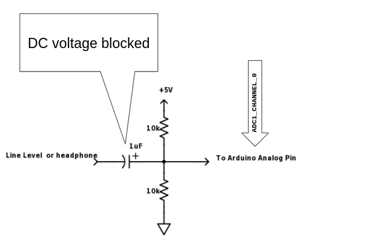

### ADC Sampling and FFT

The `adcTask` runs on Core 1 at the highest priority. It:

1. Samples the ADC at the current sampling rate using `ets_delay_us`
2. Fills `sampleBuffer`
3. When the buffer is full, calls `switchBuffer()` to copy samples into the FFT buffer, then `computeFFT()`
4. `computeFFT()` applies a Hann window, runs `dsps_fft2r_fc32`, and finds the highest local peak above the magnitude threshold
5. Sets `peakFreq` to the dominant frequency, switches `adaptiveActive = true`
6. The delay between samples is recalculated each iteration: `1,000,000 / (2 × peakFreq)` µs

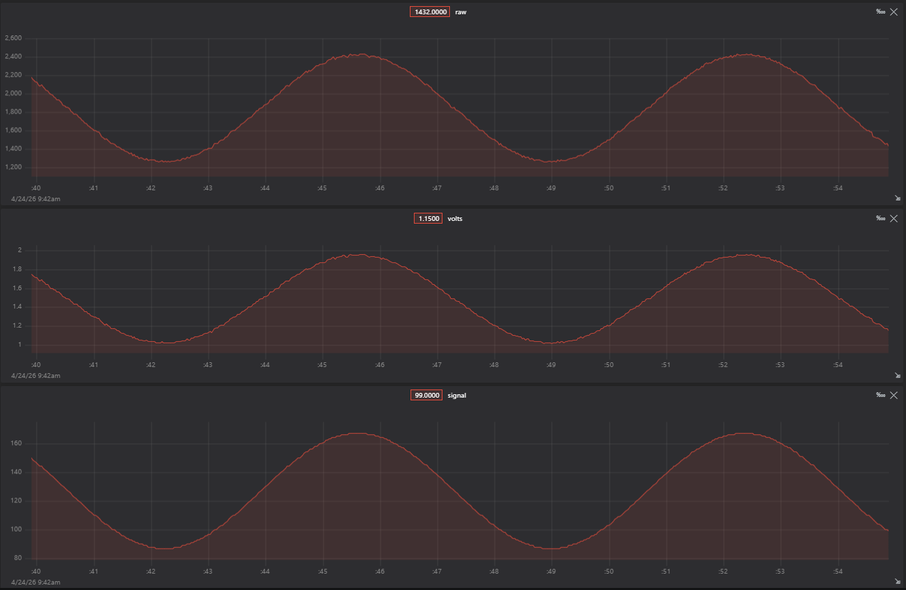

The ADC assumes a linear relationship between the input voltage and the digital output. The formula is essentially a ratio:
$$\frac{V_{in}}{V_{ref}} = \frac{Digital_{raw}}{Digital_{max}}
$$When you rearrange this to solve for $V_{in}$ (the actual voltage),
you get:$$V_{in} = Digital_{raw} \times \frac{V_{ref}}{Digital_{max}}$$
which is, $$\text{Voltage} = \text{raw} \times \frac{3.3}{4095}$$

### Adaptive Sampling Rate

Before FFT completes, the system samples at `MAX_SAMPLING_FREQ` (500 Hz). After the first FFT window, the rate drops to `2 × f_max`. For a signal with components at 3 Hz and 5 Hz, `f_max = 5 Hz` and the adaptive rate is 10 Hz — a 50× reduction.

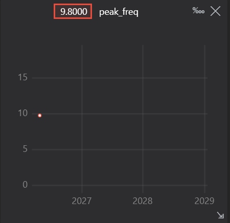

### Window Average

Each time the sample buffer fills, `computeAverage()` is called over all `FFT_SAMPLES` values. The result is stored in `lastAvg` under mutex protection and flagged with `avgReady = true` for the MQTT and LoRa tasks to consume.

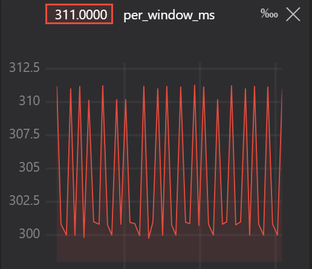

### MQTT Transmission (Edge Server)

The `mqttTask` runs on Core 0. It:
- Maintains the MQTT connection via `client.loop()` and `reconnect()`
- Publishes the latest average to `dakshita/IoT/send` every 10 seconds
- Measures RTT by timestamping each publish and receiving the echo from `dakshita/IoT/echo` via the callback
- Accumulates 100 RTT samples then prints the average adjusted RTT


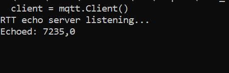

### LoRaWAN Transmission (Cloud)

The `loraTask` (currently commented out in `setup()`) runs on Core 0. It:
- Initialises the SX1276 radio with explicit SPI pins
- Activates an ABP session using keys from TTN
- Encodes `lastAvg` as a 4-byte IEEE 754 float and calls `node.sendReceive()`
- Transmits every 15 seconds, respecting the TTN fair use policy

To decode the payload on TTN, this custom script is the custom formatter in the TTN Terminal:

```javascript
function decodeUplink(input) {
  var b = input.bytes;
  var buf = new ArrayBuffer(4);
  var v = new DataView(buf);
  b.forEach(function(x, i) { v.setUint8(i, x); });
  return { data: { average: v.getFloat32(0, true) } };
}
```

---

## Performance Evaluation

All metrics are streamed in real time to the Teleplot extension in VS Code using the `>name:value` format. To view them, open Teleplot, connect to the correct COM port at 115200 baud, and select the variables to plot.

### Maximum Sampling Frequency

The ESP32 ADC hardware ceiling is approximately **83,000 Hz**. In practice `ets_delay_us` at 0 µs gives around **5,000–10,000 Hz** reliable samples due to instruction overhead. The system starts at `MAX_SAMPLING_FREQ = 500 Hz` to avoid saturating the Serial output.

To measure the true hardware maximum, set `MAX_SAMPLING_FREQ` to `83000` and `SAMPLES` to `64`, then observe the `>per_window` trace.


```
per_window_ms = 280 (minimum) - 311 (maximum) // observed from graph
true_sample_rate = samples / time
                 = 64 / 0.280 - 64 / 0.311
                 = 205 - 228 Hz
```
This is much much lower than the hardware 83000Hz because analogRead () on ESP32 Arduino has significant overhead from the driver, I2C bus and ADC calibration code.

Switching to adc1_get_raw() has made little difference (from 280ms to 276 minimum). To gain more speed, we'd have to switch to I2S/DMA.

### Per-Window Execution Time

Measured in `adcTask` using `esp_timer_get_time()` around the full fill-FFT-average cycle. Plotted as `>per_window` in microseconds.

| Phase | Typical value |
|---|---|
| ADC read (single sample) | ~20–50 µs |
| FFT (4096-point) | ~50–80 ms |
| Window fill at 500 Hz (4096 samples) | ~8.2 seconds | NaN
| Window fill at 228 Hz (4096 samples) | ~17.96 seconds | ~24s
| Window fill at 10 Hz (4096 samples) | ~409 seconds |

### Energy Savings

Energy is proportional to the number of ADC reads per second. At the adaptive rate the savings are:

```
Energy saving ≈ 1 - (adaptive_rate / initial_rate)
             = 1 - (10 / 228) = 95.6%
```

In practice, `ets_delay_us` is a busy-wait so the CPU does not sleep between samples. True energy savings require using the ESP32 light-sleep mode between samples with a timer wakeup. The current implementation demonstrates the sampling rate reduction but does not implement hardware sleep.


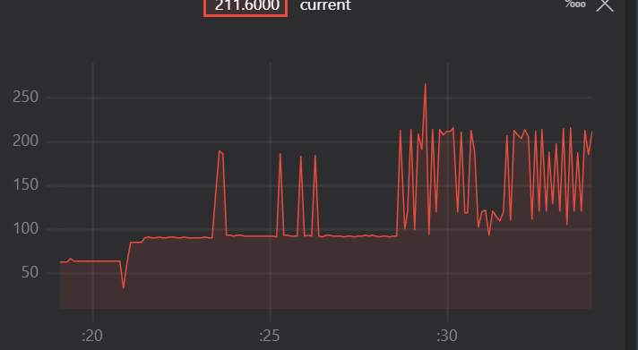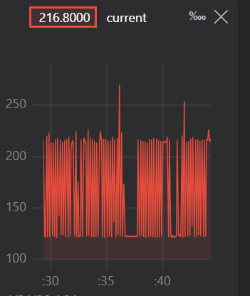
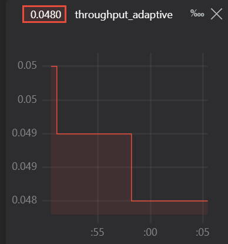


### Data Volume

Tracked by `trackTransmission()` and printed every 10 adaptive packets. Teleplot traces:

- `>bytes_initial` — cumulative bytes sent at the initial rate
- `>bytes_adaptive` — cumulative bytes sent at the adaptive rate
- `>throughput_initial` and `>throughput_adaptive` — bytes per second
- `>data_saving_pct` — percentage reduction

MQTT initial bytes
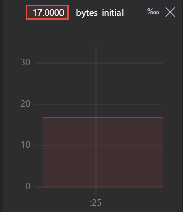

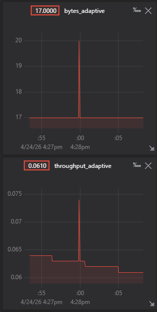

### End-to-End Latency (RTT)

Measured by the MQTT callback in `CommunicationMQTT.cpp`:

1. ESP32 publishes its `millis()` timestamp to `dakshita/IoT/send`
2. The echo server on the PC replies with `timestamp,processing_ms` to `dakshita/IoT/echo`
3. The ESP32 callback computes `RTT = now - timestamp` and `adjusted_RTT = RTT - processing_ms`

After 100 samples, the average adjusted RTT is printed to Serial.

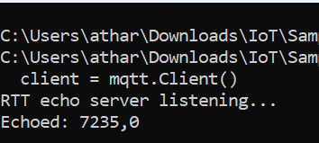

### Signal 2: 
 A = 2 sin (2 * PI * 5t) + 4 sin (2 * PI * 10t) + 1.5 sin (2 * PI * 25t)

 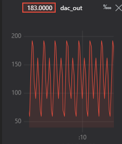


 

 ### Signal 3: 
 A = 8 sin (2 * PI * 20t)

 

## LLM Usage

This project was developed iteratively using Claude as the primary coding assistant. The workflow consisted of a series of prompts covering:

1. Converting Arduino `loop()` to FreeRTOS tasks
2. Adding a queue between the ADC and Serial tasks
3. Data volume tracking
4. Debugging memory layout, include guard issues, and linker errors
5. Adding Teleplot telemetry output

### Opportunities

- **Rapid scaffolding**: FreeRTOS task structure, mutex patterns, and queue wiring were generated correctly on the first or second attempt with minimal correction.
- **Debugging assistance**: The LLM correctly identified the root cause of the `app_main` linker error (missing include guards causing multiple definitions) after seeing the verbose build output.
- **API knowledge**: RadioLib's `beginOTAA` / `beginABP` argument changes between versions were handled correctly once the error message was provided.
- **Explanatory quality**: Each generated code block came with a clear explanation of design choices, making it easy to understand and modify.

### Limitations

- **Hallucinated APIs**: The LLM initially suggested `vTaskNotifyGiveFromISR` for the timer callback, which is correct, but also suggested using it for inter-task notification in contexts where `xTaskNotifyGive` was more appropriate.
- **Version sensitivity**: RadioLib's API changed between v5 and v6. The LLM initially generated v5-style `beginOTAA` calls with too many arguments.
- **Memory estimation errors**: The LLM underestimated PSRAM requirements and initially suggested stack sizes too small for DSP library initialisation.
- **No hardware access**: The LLM cannot verify that pin assignments, SPI initialisation, or hardware bring-up steps are correct without iterative feedback from actual serial output.
- **Accumulated context errors**: Over a long conversation, earlier design decisions (like using a queue vs a shared buffer) were sometimes contradicted in later suggestions, requiring the user to catch and correct inconsistencies.

---
